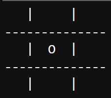
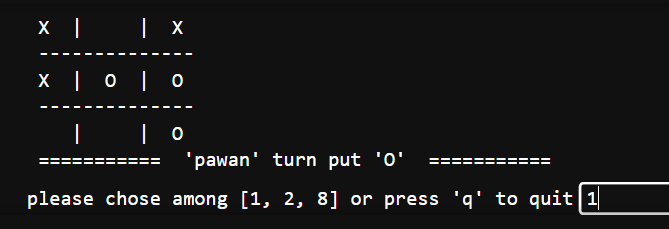
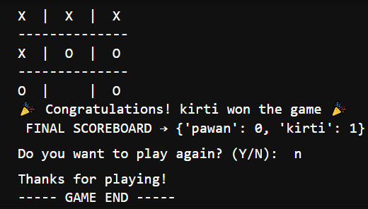

# 🎮 Tic Tac Toe (Python - Jupyter Notebook)

Welcome to Tic Tac Toe, a timeless classic reimagined in Python inside a Jupyter Notebook.
This project showcases the power of functions, conditions, loops, and randomization to create an engaging two-player game.  

<br>

## ✨ Features
- 🎲 Random player selection  
- ✏️ Player name input & validation  
- ❌/⭕ Marker selection & switching  
- 🏆 Win & Draw detection  
- 🔁 Replay option after game ends  
- 📊 Scoreboard tracking for both players  
- 🚪 Quit option during gameplay  

<br>

## 📂 Project Structure

TicTacToe/ <br>
├──tictactoe.ipynb &nbsp; &nbsp; &nbsp; &nbsp; &nbsp; &nbsp;  &nbsp; # main game implementation <br>
├── screenshots/ &nbsp; &nbsp; &nbsp; &nbsp; &nbsp; &nbsp;  &nbsp; &nbsp; # Game screenshots <br>
&nbsp; &nbsp; &nbsp; &nbsp;  ├── img1.png &nbsp;  &nbsp; &nbsp;  &nbsp; # Sample board screenshot <br>
&nbsp; &nbsp; &nbsp; &nbsp;  └── img2.png <br>
&nbsp; &nbsp; &nbsp; &nbsp;  └── img3.png <br> 
├── README.md &nbsp; &nbsp; &nbsp; &nbsp; &nbsp; &nbsp;  &nbsp; &nbsp; # Project documentation <br>

<br>


## 🖼️ Screenshots
Here’s a quick view of the game in:
<!--  -->






<br>

## 🎯 Learning Outcomes
This project helped me practice and understand:

 - Functions → breaking code into reusable parts
 - Loops → for repeated gameplay flow
 -  Conditionals → to check winning/draw logic
 -  Dictionaries → for maintaining scoreboard

<br> 

## 🚀 Getting Started

1. Clone this repository:
 ```
git clone https://github.com/PawanCodeCrafts/TicTacToe.git
```
```
  cd TicTacToe
```
2. Open the project in Jupyter Notebook / JupyterLab.
3. Run the tictactoe.ipynb notebook step by step.

## ⚙️ Requirements

-Python 3.x
-Jupyter Notebook or JupyterLab
-Install Jupyter (if not already installed):
  ```
   pip install notebook
```


## 📜 License
   This project is licensed under the MIT License.

## Contact
**Contact Me**
- **Email:** kpawanpreet2003@gmail.com
- **LinkedIn:** [linkedin.com/in/pawanpreet](https://www.linkedin.com/in/pawanpreet-2003/)
- **GitHub:** [github.com/pawancodecrafts](https://github.com/pawancodecrafts)


💡 For suggestions or feedback, feel free to open an issue in this repository!
